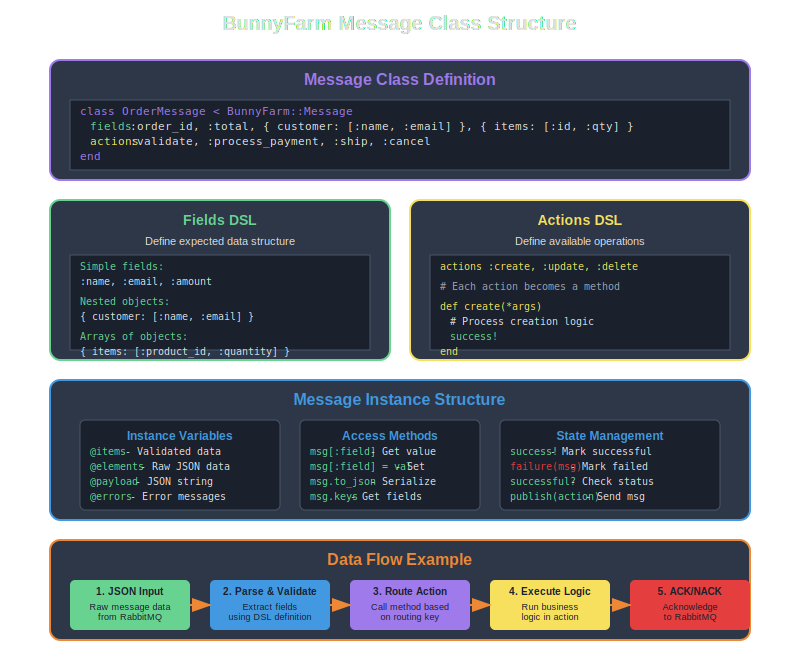

# BunnyFarm

<div align="center">
  <table>
    <tr>
      <td width="40%" align="center" valign="top">
        <a href="https://github.com/MadBomber/bunny_farm" target="_blank">
          
        </a>
        <br /><br />
        <a href="https://badge.fury.io/rb/bunny_farm"></a>
        <a href="https://opensource.org/licenses/MIT"></a>
        <br/><br/>
        <a href="https://madbomber.github.io/bunny_farm/">Comprehensive Documentation Website</a>
      </td>
      <td width="60%" align="left" valign="top">
        Like a well-organized farm where messages hop efficiently from producers to consumers, BunnyFarm provides a lightweight Ruby gem for managing background jobs using RabbitMQ. Each message becomes a living entity with its own behavior, routing intelligently through the message broker to the right workers.
        <br/><br/>
        The bunny farm is an abstraction in which the messages are encapsulated as classes.  Instances of these BunnyFarm::Messages are hopping around the RabbitMQ as JSON strings with routing keys in the form of MessageClassName.action where action is a method on the MessageClassName instance.
        <br/><br/>
        <h3>Key Features</h3>
        <ul>
            <li><strong>🐰 <a href="#message-structure">Message-Centric Design</a></strong> - Classes encapsulate behavior and data</li>
            <li><strong>🔀 <a href="#usage">Smart Routing</a></strong> - Automatic routing with ClassName.action keys</li>
            <li><strong>📨 <a href="#usage">JSON Serialization</a></strong> - Simple, readable message format</li>
            <li><strong>⚙️ <a href="#configuration">Flexible Configuration</a></strong> - Environment, YAML, or programmatic setup</li>
            <li><strong>🔄 <a href="#examples">Workflow Support</a></strong> - Multi-step processes with message chaining</li>
            <li><strong>⏰ <a href="#examples">Task Scheduling</a></strong> - Delayed execution with retry logic</li>
            <li><strong>🛡️ <a href="#examples">Error Handling</a></strong> - Built-in success/failure tracking</li>
            <li><strong>🎯 <a href="#why">Simplicity First</a></strong> - K.I.S.S. design philosophy</li>
        </ul>
      </td>
    </tr>
  </table>
</div>

## Table of Contents

* [Why?](#why)
* [How?](#how)
* [Requirements](#requirements)
* [Installation](#installation)
* [Message Structure](#message-structure)
* [Usage](#usage)
* [Configuration](#configuration)
    * [Environment Variables](#environment-variables)
    * [Programmatic Configuration](#programmatic-configuration)
    * [Configuration File](#configuration-file)
* [Testing](#testing)
* [Architecture Overview](#architecture-overview)
* [License](#license)
* [Examples](#examples)
* [Contributing](#contributing)

## Why?

- Simplistic?  Because extensive is sometimes overkill.
- JSON?        Because binary compression is sometimes overkill.
- Bunny?       Who doesn't like bunnies?  They're like cats with long ears.
- AMQP?        I like AMQP.  I like RabbitMQ as an AMQP broker.

BTW, at the farm bunnies grow best if planted ears up.

## How?

Use system environment variables.  Such as:

```bash
export AMQP_HOST=amqp.example.com
export AMQP_VHOST=sandbox
export AMQP_EXCHANGE=sandbox
export AMQP_QUEUE=tv_show_suggestions
export AMQP_ROUTING_KEY="TvShowSuggestion.submit"
export AMQP_PASS=guest
export AMQP_USER=guest
```

If you don't know how AMQP works you had better go study.  The
values above were selected to match the demo code below.

## Requirements

- Ruby 2.5 or higher
- RabbitMQ server
- Bundler

## Installation

Add this line to your application's Gemfile:

```ruby
gem 'bunny_farm'
```

And then execute:

    bundle install

Or install it yourself as:

    gem install bunny_farm

## Message Structure

Understanding how BunnyFarm messages are structured is key to using the library effectively:



## Usage

The shortest job manager / message processor looks like this:

```ruby
require 'bunny_farm'
require 'my_message_class'

BunnyFarm.config
BunnyFarm.manage  # This will block and process messages
```

Here is how to publish messages:

```ruby
require 'bunny_farm'
require 'my_message_class'

BunnyFarm.config do
  app_id 'my_job_name'
end

mm = MyMessageClass.new

mm[:field1] = 'Hello'
mm[:field2] = 'World'
# ...
mm[:fieldn] = 'whatever'

mm.publish('action') # routing key becomes: MyMessageClass.action

puts 'It worked' if mm.successful?

if mm.failed?
  puts 'This sucks.  Here are some errors:'
  puts mm.errors.join("\n")
end
# rinse and repeat as necessary
```


All processing is done in YourMessageClass.  The
AMQP routing keys look like: "YourMessageClass.action" and
guess what the "action" is... a method in YourMessageClass.

So assume that I have a public facing website which allows users
to fill our forms for various purposes.  Say that one of those
forms is to collect suggestions for episodes of a TV show.  I would have a
form with fields that collect informaion about the user as well as a field
where their suggestion is recorded.  As a hash it might looks something
like this:

```ruby
form_contents = {
	author: {
		name: 'Jimmy Smith',
		mailing_address: '123 Main St. USA',
		email_address: 'little_jimmy@smith.us',
		phone_number: '+19995551212'
	},
	tv_show_name: 'Lost In Space',
	suggestion: 'Why does doctor Smith have to be such a meanie?',
	lots_of_other_house_keeping_junk: {}
}
```

The website turns that hash into a json package and publishes it
via an AMQP broker.  I like RabbitMQ.  The published message has
a routing key of 'TvShowSuggestion.submit'

In the file tv_show_suggestion.rb you could have something like this:

```ruby
class TvShowSuggestion < BunnyFarm::Message

  fields :tv_show_name, :suggestion,
    { author: [ :name, :mailing_address, :email_address, :phone_number ]}

	actions :submit

	def submit
		# TODO: anything you want.
		save_suggestion
		notify_writers  if success?
		success? ? send_thank_you : send_sorry_please_try_again
		success!
		some_super_class_service
		successful? # true will ACK the message; false will not
	end

private

	def save_suggestion
		puts @items[:suggestion]
		success
	end

	def notify_writers
		puts "Hey slackers! what about #{@items[:suggestion]}"
		failure('Writers were sleeping')
	end

	def send_thank_you
		puts "Thank you goes to #{@items[:author][:name]}"
		success
	end

	def send_sorry_please_try_again
		STDERR.puts "Sorry #{@items[:author][:name]}, please try again later."
	end
end # class TvShowSuggestion < BunnyFarm::Message
```

## Configuration

BunnyFarm provides flexible configuration options to suit different environments and deployment scenarios:


BunnyFarm can be configured using environment variables or programmatically:

### Environment Variables

```bash
export AMQP_HOST=localhost
export AMQP_VHOST=/
export AMQP_PORT=5672
export AMQP_USER=guest
export AMQP_PASS=guest
export AMQP_EXCHANGE=my_exchange
export AMQP_QUEUE=my_queue
export AMQP_ROUTING_KEY='#.new'
export AMQP_APP_NAME=my_app
```

### Programmatic Configuration

```ruby
BunnyFarm.config do
  env 'production'
  app_id 'my_worker'
  bunny_file 'config/bunny.yml.erb'
end
```

### Configuration File

You can also use a YAML configuration file with ERB support (`config/bunny.yml.erb`):

```yaml
defaults: &defaults
  host: <%= ENV['AMQP_HOST'] || 'localhost' %>
  vhost: <%= ENV['AMQP_VHOST'] || '/' %>
  port: <%= (ENV['AMQP_PORT'] || 5672).to_i %>
  user: <%= ENV['AMQP_USER'] || 'guest' %>
  pass: <%= ENV['AMQP_PASS'] || 'guest' %>
  exchange_name: <%= ENV['AMQP_EXCHANGE'] || 'my_exchange' %>
  queue_name: <%= ENV['AMQP_QUEUE'] || 'my_queue' %>
  routing_key: <%= ENV['AMQP_ROUTING_KEY'] || '#' %>
  app_name: <%= ENV['AMQP_APP_NAME'] || 'bunny_farm_job' %>

development:
  <<: *defaults

test:
  <<: *defaults

production:
  <<: *defaults
  host: amqp.production.com
```

## Testing

```bash
bundle exec rake test
```

## Architecture Overview

BunnyFarm provides a clean, layered architecture that separates concerns and enables scalable message processing:


The architecture consists of four main layers:

1. **Ruby Application Layer** - Your web apps, API servers, schedulers, and worker processes
2. **BunnyFarm Library Layer** - Core components including Message classes, Publisher, Consumer, Config, and Router
3. **RabbitMQ Message Broker** - Handles message routing, queuing, and delivery with exchanges and queues
4. **Persistence & External Services** - Databases, email services, file storage, APIs, and caching layers

This separation allows for:
- **Horizontal scaling** - Add more workers as needed
- **Fault tolerance** - Messages persist in queues if workers are down
- **Flexible routing** - Different message types can go to different workers
- **Monitoring** - RabbitMQ provides comprehensive management tools

## License

The gem is available as open source under the terms of the [MIT License](https://opensource.org/licenses/MIT).

## Examples

Check out the [examples directory](examples/) for comprehensive, runnable examples including:

- **Simple Producer/Consumer**: Basic message publishing and processing
- **Order Processing Workflow**: Complex multi-step workflows with error handling
- **Task Scheduler**: Scheduled tasks with retry logic and failure recovery

Each example includes detailed documentation and can be run independently to help you understand BunnyFarm's capabilities.

## Contributing

Remember the key design goal is K.I.S.S.  Edge cases and exotic stuff
are not what life is like on the bunny farm.

1. Fork it ( https://github.com/MadBomber/bunny_farm/fork )
2. Create your feature branch (`git checkout -b my-new-feature`)
3. Commit your changes (`git commit -am 'Add some feature'`)
4. Push to the branch (`git push origin my-new-feature`)
5. Create a new Pull Request
