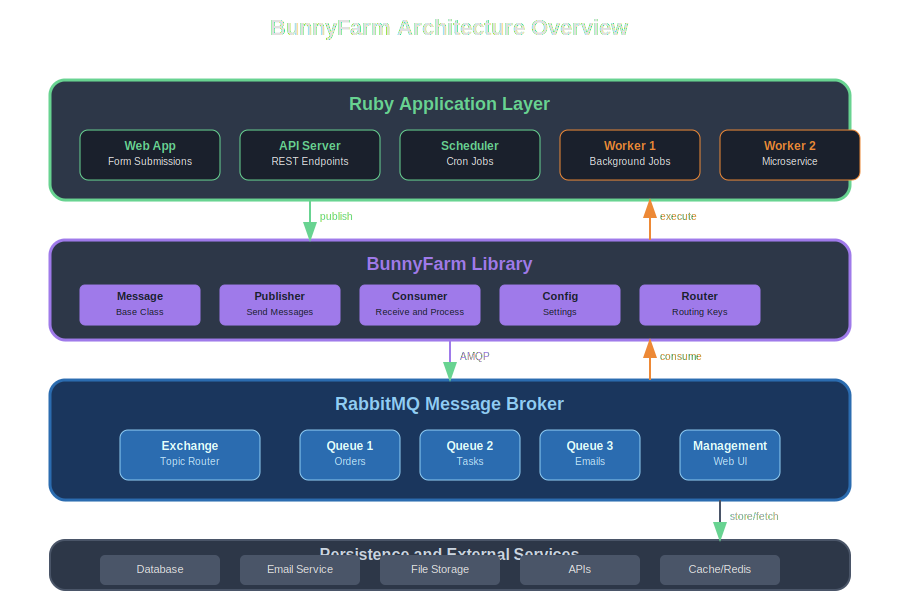

# Architecture Overview

BunnyFarm provides a clean, layered architecture that separates concerns and enables scalable message processing. This section covers the overall system design and how components interact.



## Architectural Layers

### 1. Ruby Application Layer

The top layer consists of your Ruby applications that produce and consume messages:

**Producers:**
- Web applications handling user requests
- API servers processing external requests  
- Scheduled jobs and cron tasks
- Other microservices

**Consumers:**
- Background worker processes
- Microservices handling specific domains
- Event processors
- Data pipeline components

### 2. BunnyFarm Library Layer

The BunnyFarm library provides the core abstractions and functionality:

**Core Components:**

#### Message Classes
- Base class for all message types
- DSL for defining data structure (fields)
- DSL for defining operations (actions)
- Built-in serialization and validation

#### Publisher
- Message publishing functionality
- Connection management
- Routing key generation
- Error handling

#### Consumer
- Message consumption and processing
- Automatic deserialization
- Action method routing
- ACK/NACK management

#### Configuration
- Environment-based configuration
- YAML configuration file support
- Programmatic configuration
- Connection parameter management

#### Router
- Routing key parsing and generation
- Action method dispatching
- Message type resolution

### 3. RabbitMQ Message Broker

RabbitMQ serves as the message broker layer:

**Key Components:**

#### Exchange
- Routes messages based on routing keys
- Typically uses topic exchange for flexible routing
- Handles message durability and persistence

#### Queues
- Store messages until consumed
- Support various configurations (durable, auto-delete, etc.)
- Handle message ordering and priority

#### Management Interface
- Web-based administration
- Queue and exchange monitoring
- Performance metrics and alerts

### 4. Persistence & External Services

The bottom layer includes external dependencies:

- **Databases** - For persistent data storage
- **Email Services** - For notification sending
- **File Storage** - For document and media handling
- **External APIs** - For third-party integrations
- **Caching** - Redis/Memcached for performance

## Message Flow Architecture


The message processing follows a predictable flow:

### 1. Message Creation
```ruby
message = OrderMessage.new
message[:order_id] = 12345
message[:customer] = customer_data
```

### 2. Publishing
```ruby
message.publish('process') # Creates routing key: OrderMessage.process
```

### 3. RabbitMQ Routing
- Exchange receives message with routing key
- Routes to appropriate queue(s) based on bindings
- Message persisted until consumed

### 4. Consumption
```ruby
BunnyFarm.manage # Consumer polls for messages
```

### 5. Processing
- Message deserialized from JSON
- Appropriate action method called
- Business logic executed

### 6. Acknowledgment
- Success returns `true` → ACK sent to RabbitMQ
- Failure returns `false` → NACK sent (message requeued or dead-lettered)

## Design Principles

### Message-Centric Design

Messages are first-class objects that encapsulate both data and behavior:

```ruby
class OrderMessage < BunnyFarm::Message
  # Data structure
  fields :order_id, :customer, :items
  
  # Behavior  
  actions :validate, :process, :ship
  
  def validate
    # Validation logic
  end
end
```

This approach provides:
- **Encapsulation** - Data and behavior stay together
- **Discoverability** - Easy to understand what a message can do
- **Testability** - Individual message types can be unit tested

### Predictable Routing

Routing keys follow a consistent pattern:

```
MessageClassName.action
```

Examples:
- `OrderMessage.process`
- `EmailMessage.send`
- `ReportMessage.generate`

Benefits:
- **Transparency** - Easy to understand message flow
- **Debugging** - Clear routing paths
- **Monitoring** - Trackable message types

### JSON Serialization

All message data uses JSON serialization:

```json
{
  "order_id": 12345,
  "customer": {
    "name": "John Doe", 
    "email": "john@example.com"
  },
  "items": [
    {"product_id": 1, "quantity": 2}
  ]
}
```

Advantages:
- **Human readable** - Easy debugging and monitoring
- **Language agnostic** - Other systems can integrate
- **Tooling support** - JSON tools widely available

## Scalability Patterns

### Horizontal Scaling

Add more consumers to handle increased load:

```ruby
# Worker 1
BunnyFarm.config { app_id 'worker_1' }
BunnyFarm.manage

# Worker 2  
BunnyFarm.config { app_id 'worker_2' }
BunnyFarm.manage

# Worker N...
```

Multiple consumers can process messages from the same queue concurrently.

### Queue Partitioning

Use different queues for different message types or priorities:

```ruby
# High priority queue
BunnyFarm.config do
  queue_name 'high_priority_orders'
  routing_key 'OrderMessage.urgent'
end

# Normal priority queue
BunnyFarm.config do  
  queue_name 'normal_orders'
  routing_key 'OrderMessage.process'
end
```

### Load Balancing

RabbitMQ automatically load balances messages across multiple consumers using round-robin distribution.

## Fault Tolerance

### Message Persistence

Messages can be persisted to disk:

```ruby
BunnyFarm.config do
  exchange_options durable: true
  queue_options durable: true
  message_options persistent: true
end
```

### Error Handling

Failed messages can be:
- **Retried** - Requeued automatically
- **Dead lettered** - Sent to error queue
- **Logged** - For manual inspection

```ruby
def risky_operation
  begin
    perform_work
    success!
  rescue => e
    failure("Operation failed: #{e.message}")
  end
  
  successful?
end
```

### Circuit Breaker Pattern

Prevent cascading failures:

```ruby
def external_service_call
  if circuit_breaker.open?
    failure("Circuit breaker open - service unavailable")
    return
  end
  
  begin
    result = external_service.call
    circuit_breaker.record_success
    success!
  rescue => e
    circuit_breaker.record_failure
    failure("External service failed: #{e.message}")
  end
  
  successful?
end
```

## Monitoring and Observability

### RabbitMQ Management

Built-in monitoring via RabbitMQ management interface:
- Queue depths and rates
- Consumer activity  
- Message flow metrics
- Connection status

### Application Metrics

Track application-level metrics:

```ruby
def process_order
  StatsD.increment 'orders.processing.started'
  
  result = perform_processing
  
  if successful?
    StatsD.increment 'orders.processing.success'
  else
    StatsD.increment 'orders.processing.failed'
  end
  
  result
end
```

### Logging

Structured logging for message processing:

```ruby
def process_order
  logger.info "Processing order", order_id: @items[:order_id]
  
  # ... processing
  
  if successful?
    logger.info "Order processed successfully", order_id: @items[:order_id]
  else
    logger.error "Order processing failed", 
                 order_id: @items[:order_id], 
                 errors: errors
  end
end
```

## Integration Patterns

### Event-Driven Architecture

Use BunnyFarm for event-driven communication between services:

```ruby
# Service A publishes events
order_created = OrderCreatedEvent.new
order_created[:order_id] = order.id
order_created.publish('notify_services')

# Service B subscribes to events
class OrderCreatedEvent < BunnyFarm::Message
  actions :update_inventory, :send_confirmation
  
  def update_inventory
    # Update inventory service
  end
  
  def send_confirmation  
    # Send customer confirmation
  end
end
```

### Saga Pattern

Implement distributed transactions:

```ruby
class OrderSaga < BunnyFarm::Message
  actions :start, :process_payment, :reserve_inventory, 
          :ship_order, :complete, :compensate
          
  def start
    # Begin saga
    next_step('process_payment')
  end
  
  def process_payment
    if payment_successful?
      next_step('reserve_inventory')
    else
      compensate('payment_failed')
    end
  end
  
  private
  
  def next_step(action)
    self.class.new(@items).publish(action)
  end
end
```

## Performance Considerations

### Connection Pooling

For high-throughput scenarios:

```ruby
BunnyFarm.config do
  connection_pool_size 10
  channel_pool_size 20
end
```

### Batch Processing

Process multiple messages together:

```ruby
def process_batch
  messages = consume_batch(size: 100)
  
  ActiveRecord::Base.transaction do
    messages.each(&:process)
  end
end
```

### Memory Management

For long-running consumers:

```ruby
def process_with_memory_management
  GC.start if processed_count % 1000 == 0
  
  # Process message
  
  ensure
    # Cleanup resources
end
```

## Next Steps

Explore specific architectural topics:

- **[Message Flow](message-flow.md)** - Detailed message processing flow
- **[Scaling Patterns](scaling.md)** - Horizontal and vertical scaling strategies  
- **[Integration Patterns](integration.md)** - Common integration scenarios
- **[Configuration](../configuration/overview.md)** - Architecture configuration options