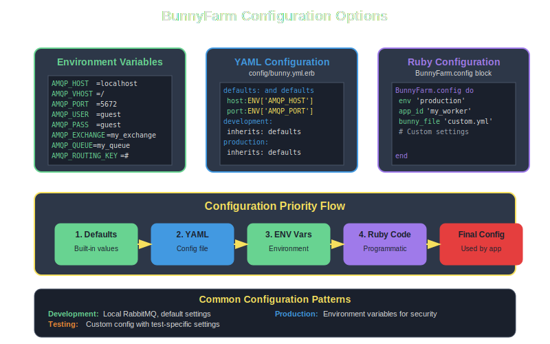

# Configuration Overview

BunnyFarm provides flexible configuration options to suit different environments and deployment scenarios. This guide covers all available configuration methods and options.



## Configuration Methods

BunnyFarm supports multiple configuration approaches that follow a clear priority hierarchy:

1. **Built-in defaults** - Safe defaults for development
2. **YAML configuration files** - Environment-specific settings
3. **Environment variables** - Runtime configuration
4. **Programmatic configuration** - Code-based overrides

Later configurations override earlier ones, giving you maximum flexibility.

## Environment Variables

The simplest way to configure BunnyFarm is through environment variables:

```bash
# Connection settings
export AMQP_HOST=localhost
export AMQP_VHOST=/
export AMQP_PORT=5672
export AMQP_USER=guest
export AMQP_PASS=guest

# Message routing
export AMQP_EXCHANGE=my_exchange
export AMQP_QUEUE=my_queue
export AMQP_ROUTING_KEY='#'

# Application identity
export AMQP_APP_NAME=my_app
```

## Programmatic Configuration

Configure BunnyFarm directly in your Ruby code:

```ruby
BunnyFarm.config do
  env 'production'
  app_id 'order_processor'
  bunny_file 'config/rabbitmq.yml.erb'
end
```

### Available Options

#### Basic Configuration
```ruby
BunnyFarm.config do
  app_id 'my_application'        # Application identifier
  env 'production'               # Environment name  
end
```

#### File-based Configuration
```ruby
BunnyFarm.config do
  bunny_file 'config/custom.yml' # Custom config file path
end
```

## YAML Configuration

Use YAML files for environment-specific configuration with ERB support:

**config/bunny.yml.erb:**
```yaml
defaults: &defaults
  host: <%= ENV['AMQP_HOST'] || 'localhost' %>
  vhost: <%= ENV['AMQP_VHOST'] || '/' %>
  port: <%= (ENV['AMQP_PORT'] || 5672).to_i %>
  user: <%= ENV['AMQP_USER'] || 'guest' %>
  pass: <%= ENV['AMQP_PASS'] || 'guest' %>
  exchange_name: <%= ENV['AMQP_EXCHANGE'] || 'my_exchange' %>
  queue_name: <%= ENV['AMQP_QUEUE'] || 'my_queue' %>
  routing_key: <%= ENV['AMQP_ROUTING_KEY'] || '#' %>
  app_name: <%= ENV['AMQP_APP_NAME'] || 'bunny_farm_job' %>

development:
  <<: *defaults

test:
  <<: *defaults
  exchange_name: test_exchange
  queue_name: test_queue

production:
  <<: *defaults
  host: amqp.production.com
  exchange_name: prod_exchange
```

## Configuration Parameters

### Connection Parameters

| Parameter | Environment Variable | Description | Default |
|-----------|---------------------|-------------|---------|
| `host` | `AMQP_HOST` | RabbitMQ server hostname | `localhost` |
| `vhost` | `AMQP_VHOST` | Virtual host | `/` |
| `port` | `AMQP_PORT` | Connection port | `5672` |
| `user` | `AMQP_USER` | Username | `guest` |
| `pass` | `AMQP_PASS` | Password | `guest` |

### Message Routing Parameters

| Parameter | Environment Variable | Description | Default |
|-----------|---------------------|-------------|---------|
| `exchange_name` | `AMQP_EXCHANGE` | Exchange name | `bunny_farm_exchange` |
| `queue_name` | `AMQP_QUEUE` | Queue name | `bunny_farm_queue` |
| `routing_key` | `AMQP_ROUTING_KEY` | Routing key pattern | `#` |

### Application Parameters

| Parameter | Environment Variable | Description | Default |
|-----------|---------------------|-------------|---------|
| `app_name` | `AMQP_APP_NAME` | Application name | `bunny_farm_app` |

## Environment-Specific Configuration

### Development Configuration
```ruby
# config/environments/development.rb
BunnyFarm.config do
  env 'development'
  # Uses local RabbitMQ with default settings
end
```

### Production Configuration
```ruby
# config/environments/production.rb  
BunnyFarm.config do
  env 'production'
  bunny_file Rails.root.join('config', 'rabbitmq.yml.erb')
end
```

### Test Configuration
```ruby
# config/environments/test.rb
BunnyFarm.config do
  env 'test'
  app_id 'test_suite'
end
```

## Common Configuration Patterns

### Docker Configuration
```bash
# docker-compose.yml environment section
environment:
  - AMQP_HOST=rabbitmq
  - AMQP_EXCHANGE=app_exchange
  - AMQP_QUEUE=app_queue
  - AMQP_USER=app_user
  - AMQP_PASS=secret_password
```

### Kubernetes Configuration
```yaml
# k8s-configmap.yaml
apiVersion: v1
kind: ConfigMap
metadata:
  name: bunny-farm-config
data:
  AMQP_HOST: "rabbitmq-service"
  AMQP_EXCHANGE: "production_exchange"
  AMQP_QUEUE: "production_queue"
```

### Cloud Configuration
```ruby
# For cloud RabbitMQ services
BunnyFarm.config do
  case ENV['RAILS_ENV']
  when 'production'
    # Use CloudAMQP URL
    connection_string ENV['CLOUDAMQP_URL']
  when 'staging'  
    connection_string ENV['STAGING_AMQP_URL']
  end
end
```

## Advanced Configuration

### Connection Options
```ruby
BunnyFarm.config do
  connection_options do
    heartbeat 30
    connection_timeout 10
    read_timeout 30
    write_timeout 30
  end
end
```

### Exchange Options
```ruby
BunnyFarm.config do
  exchange_options do
    durable true
    auto_delete false
    type :topic
  end
end
```

### Queue Options  
```ruby
BunnyFarm.config do
  queue_options do
    durable true
    auto_delete false
    exclusive false
    arguments({
      'x-message-ttl' => 60000,
      'x-max-length' => 1000
    })
  end
end
```

### Message Options
```ruby
BunnyFarm.config do
  message_options do
    persistent true
    mandatory false
    immediate false
  end
end
```

## Configuration Validation

BunnyFarm validates configuration at startup:

```ruby
begin
  BunnyFarm.config do
    host 'invalid-host'
    port 'invalid-port'
  end
rescue BunnyFarm::ConfigurationError => e
  puts "Configuration error: #{e.message}"
end
```

## Best Practices

### 1. Use Environment Variables for Secrets
```ruby
# Good: Use environment variables for sensitive data
BunnyFarm.config do
  user ENV['RABBITMQ_USER']
  pass ENV['RABBITMQ_PASSWORD']
end

# Avoid: Hard-coding secrets
BunnyFarm.config do
  user 'admin'
  pass 'secret123' # Don't do this!
end
```

### 2. Environment-Specific Configuration
```ruby
# config/application.rb
case Rails.env
when 'development'
  BunnyFarm.config { env 'development' }
when 'test'
  BunnyFarm.config { env 'test' }  
when 'production'
  BunnyFarm.config do
    env 'production'
    bunny_file 'config/production_rabbitmq.yml'
  end
end
```

### 3. Connection Pooling for High Load
```ruby
BunnyFarm.config do
  connection_pool_size 10
  channel_pool_size 50
end
```

### 4. Monitoring Configuration
```ruby
BunnyFarm.config do
  # Enable detailed logging
  log_level :info
  
  # Health check endpoint
  health_check_enabled true
  health_check_port 8080
end
```

## Configuration Debugging

### Check Current Configuration
```ruby
# In Rails console or Ruby script
puts BunnyFarm.current_config.inspect
```

### Test Connection
```ruby
# Verify connection works
BunnyFarm.test_connection
```

### Configuration Validation
```ruby
# Validate configuration without connecting
BunnyFarm.validate_config
```

## Troubleshooting

### Common Issues

#### Connection Refused
```
Error: Connection refused - connect(2)
```

**Solutions:**
- Verify RabbitMQ is running: `systemctl status rabbitmq-server`
- Check host and port configuration
- Verify firewall settings

#### Authentication Failed  
```
Error: ACCESS_REFUSED - Login was refused
```

**Solutions:**
- Verify username and password
- Check user permissions in RabbitMQ
- Ensure virtual host exists and user has access

#### Exchange/Queue Not Found
```
Error: NOT_FOUND - no exchange 'my_exchange'
```

**Solutions:**
- Create exchange and queue manually
- Enable auto-creation in configuration
- Check exchange/queue names for typos

## Next Steps

With configuration mastered, explore:

- **[Environment Variables](environment-variables.md)** - Complete environment variable reference
- **[YAML Configuration](yaml-configuration.md)** - Advanced YAML configuration patterns
- **[Programmatic Setup](programmatic-setup.md)** - Dynamic configuration scenarios