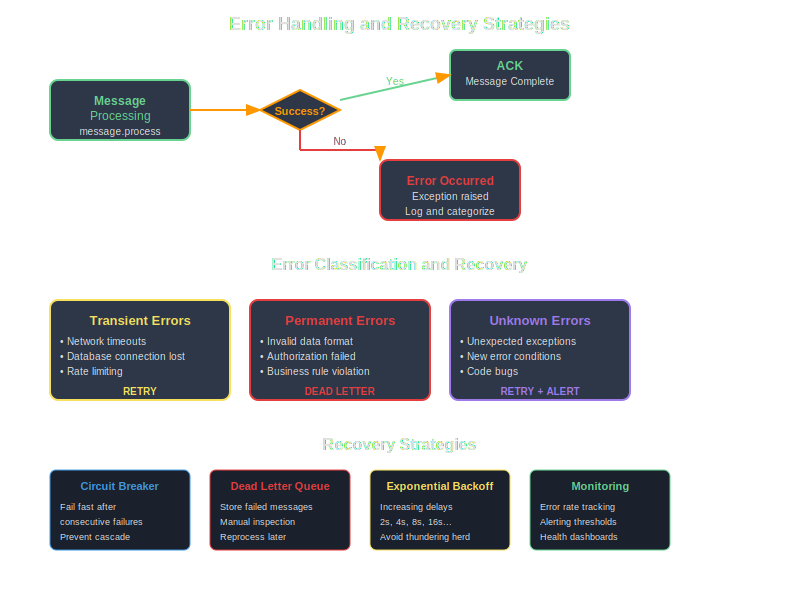

# Error Handling

BunnyFarm provides comprehensive error handling mechanisms that help build resilient message processing systems with proper failure management and recovery strategies.



## Built-in Error Tracking

```ruby
class OrderMessage < BunnyFarm::Message
  def process
    validate_order
    return unless successful?
    
    process_payment
    return unless successful?
    
    fulfill_order
    return unless successful?
    
    success!
    successful?
  end
  
  private
  
  def validate_order
    failure("Order ID required") unless @items[:order_id]
    failure("Customer email required") unless @items[:customer_email]
    
    success! if errors.empty?
  end
end
```

## Error Recovery Patterns

### Retry with Exponential Backoff

```ruby
def process_with_retry
  attempt = @items[:attempt] || 1
  
  begin
    risky_operation
    success!
  rescue RetryableError => e
    if attempt < 3
      delay = 2 ** attempt
      retry_message = self.class.new(@items)
      retry_message[:attempt] = attempt + 1
      retry_message.publish_delayed('process_with_retry', delay: delay)
      success!  # Don't fail original message
    else
      failure("Failed after #{attempt} attempts: #{e.message}")
    end
  end
  
  successful?
end
```

### Dead Letter Handling

```ruby
class FailedMessage < BunnyFarm::Message
  actions :investigate, :retry, :archive
  
  def investigate
    puts "Investigating failed message: #{@items[:original_error]}"
    success!
  end
end
```

## Best Practices

1. Always handle exceptions gracefully
2. Provide meaningful error messages
3. Implement retry logic for transient failures
4. Use dead letter queues for persistent failures
5. Log errors for debugging and monitoring