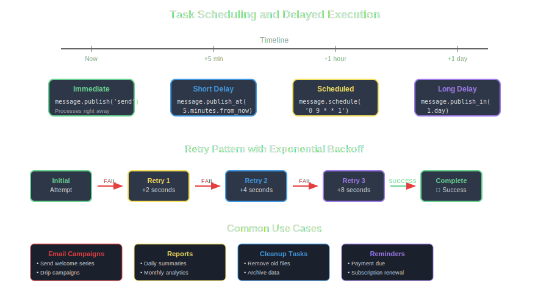

# Task Scheduling

BunnyFarm supports delayed message processing and task scheduling, allowing you to build sophisticated time-based workflows and recurring operations.



## Delayed Messages

```ruby
class ScheduledTask < BunnyFarm::Message
  actions :schedule, :execute
  
  def schedule
    # Schedule execution for later
    delay_seconds = @items[:delay] || 3600  # 1 hour default
    
    # Use RabbitMQ delayed message plugin or custom delay queue
    publish_delayed('execute', delay: delay_seconds)
    success!
  end
  
  def execute
    puts "Executing scheduled task at #{Time.current}"
    perform_scheduled_work
    success!
  end
end
```

## Recurring Tasks

```ruby
def execute_recurring
  perform_work
  
  # Schedule next execution
  next_run = @items[:interval] || 3600  # 1 hour
  self.class.new(@items).publish_delayed('execute_recurring', delay: next_run)
  
  success!
end
```

## Retry Patterns

```ruby
def execute_with_retry
  begin
    risky_operation
    success!
  rescue => e
    retry_count = (@items[:retry_count] || 0) + 1
    
    if retry_count < 3
      delay = 2 ** retry_count  # Exponential backoff
      
      retry_msg = self.class.new(@items)
      retry_msg[:retry_count] = retry_count
      retry_msg.publish_delayed('execute_with_retry', delay: delay)
      
      success!
    else
      failure("Max retries exceeded: #{e.message}")
    end
  end
end
```