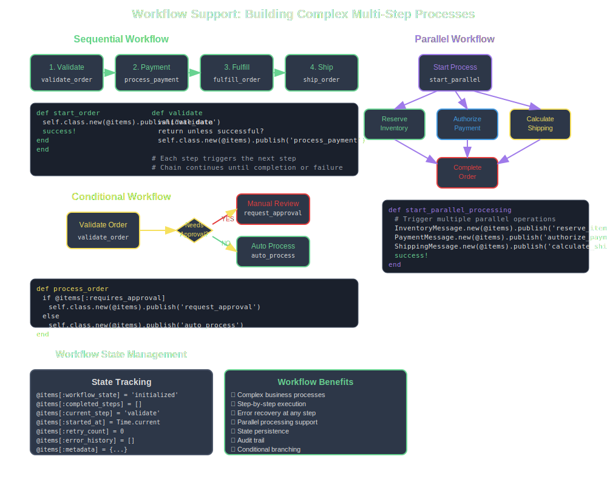

# Workflow Support

BunnyFarm excels at building complex, multi-step workflows where messages can trigger subsequent operations, creating sophisticated business processes through message chaining and coordination.



## Workflow Patterns

### Sequential Workflows

Messages can trigger follow-up messages in sequence:

```ruby
class OrderWorkflow < BunnyFarm::Message
  actions :start_order, :validate, :process_payment, :fulfill, :ship, :complete
  
  def start_order
    # Step 1: Validate order
    self.class.new(@items).publish('validate')
    success!
  end
  
  def validate
    validate_order_data
    return unless successful?
    
    # Step 2: Process payment
    self.class.new(@items).publish('process_payment')
    success!
  end
  
  def process_payment
    charge_customer
    return unless successful?
    
    # Step 3: Fulfill order
    self.class.new(@items).publish('fulfill')
    success!
  end
end
```

### Conditional Workflows

```ruby
def process_order
  validate_order
  return unless successful?
  
  if @items[:requires_approval]
    self.class.new(@items).publish('request_approval')
  else
    self.class.new(@items).publish('auto_process')
  end
  
  success!
end
```

### Parallel Workflows

```ruby
def start_parallel_processing
  # Trigger multiple parallel operations
  InventoryMessage.new(@items).publish('reserve_items')
  PaymentMessage.new(@items).publish('authorize_payment')
  ShippingMessage.new(@items).publish('calculate_shipping')
  
  success!
end
```

## State Management

### Workflow State Tracking

```ruby
class OrderWorkflow < BunnyFarm::Message
  def initialize
    super
    @items[:workflow_state] = 'initialized'
    @items[:completed_steps] = []
  end
  
  def validate
    @items[:workflow_state] = 'validating'
    
    perform_validation
    
    if successful?
      @items[:completed_steps] << 'validate'
      @items[:workflow_state] = 'validated'
      trigger_next_step
    end
  end
  
  private
  
  def trigger_next_step
    case @items[:workflow_state]
    when 'validated'
      self.class.new(@items).publish('process_payment')
    when 'payment_processed'
      self.class.new(@items).publish('fulfill')
    end
  end
end
```

## Next Steps

Workflows enable complex business processes through message orchestration.