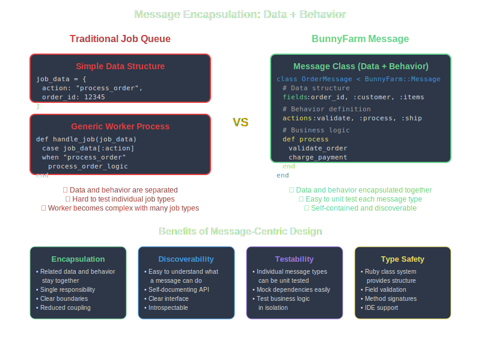
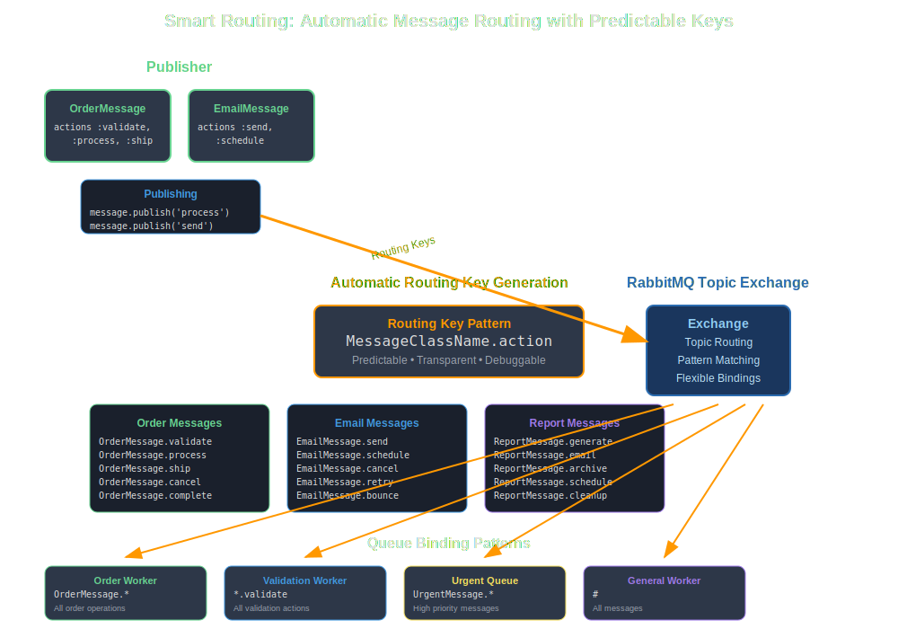
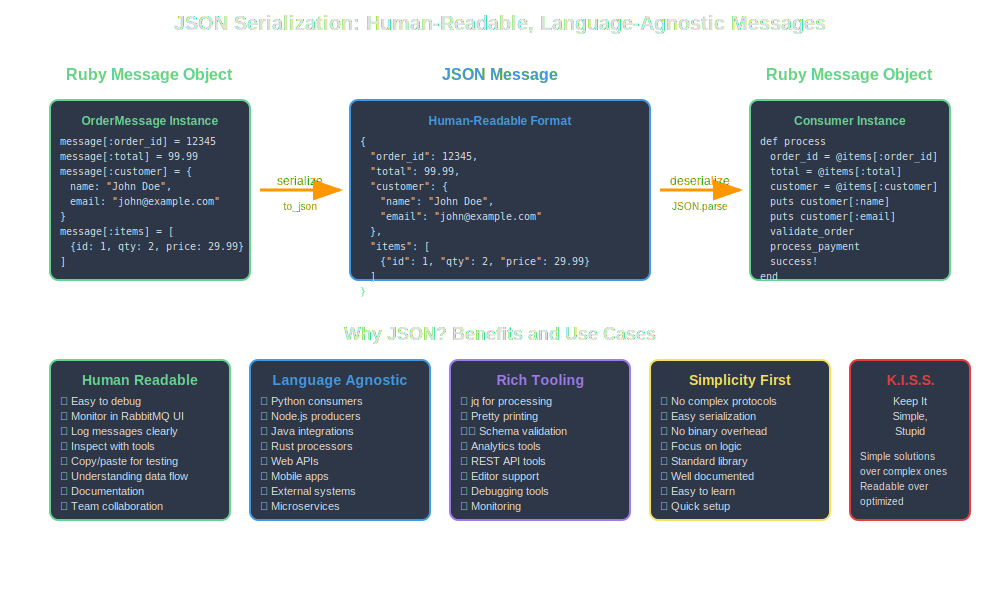
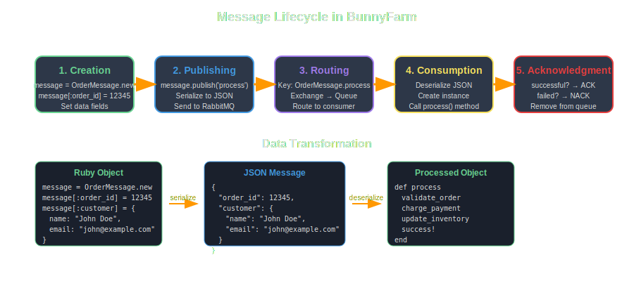

# Basic Concepts

Understanding BunnyFarm's core concepts will help you design effective message-driven applications. This guide covers the fundamental principles behind BunnyFarm's architecture.

## Message-Centric Architecture

BunnyFarm is built around the concept of **messages as living entities**. Unlike traditional job queues where jobs are simple data structures, BunnyFarm messages are full Ruby classes that encapsulate both data and behavior.



```ruby
class OrderMessage < BunnyFarm::Message
  # Data structure
  fields :order_id, :customer_email, :items
  
  # Behavior
  actions :process, :ship, :cancel
  
  def process
    validate_order
    charge_payment
    update_inventory
    success!
  end
end
```

## Core Components

### 1. Message Classes

Message classes inherit from `BunnyFarm::Message` and define:

- **Fields**: The data structure using the `fields` DSL
- **Actions**: Available operations using the `actions` DSL  
- **Methods**: Business logic for each action

### 2. Routing Keys

BunnyFarm uses a predictable routing pattern:

```
MessageClassName.action
```

Examples:
- `OrderMessage.process`
- `EmailMessage.send`
- `ReportMessage.generate`

This makes routing transparent and debuggable.



### 3. JSON Serialization

All message data is serialized as JSON for:
- **Human readability** - Easy debugging and monitoring
- **Language interoperability** - Other systems can read/write messages
- **Simplicity** - No complex binary protocols



## Message Lifecycle



1. **Creation**: Message instance is created with data
2. **Publishing**: Message is serialized to JSON and sent to RabbitMQ
3. **Routing**: RabbitMQ routes based on the routing key
4. **Consumption**: Worker receives and deserializes the message
5. **Processing**: The appropriate action method is called
6. **Acknowledgment**: Success/failure determines ACK/NACK

## Fields DSL

The `fields` DSL defines the expected data structure:

```ruby
class CustomerMessage < BunnyFarm::Message
  fields :name, :email, 
         { address: [:street, :city, :state, :zip] },
         { preferences: [:newsletter, :promotions] }
end
```

This creates:
- Simple fields: `name`, `email`
- Nested objects: `address` with sub-fields
- Arrays: `preferences` as a list

## Actions DSL

The `actions` DSL defines available operations:

```ruby
class OrderMessage < BunnyFarm::Message
  actions :validate, :process, :ship, :cancel, :refund
  
  def validate
    # Validation logic
  end
  
  def process
    # Processing logic  
  end
  
  # ... other action methods
end
```

Each action becomes a routable endpoint.

## Data Access

BunnyFarm provides hash-like access to message data:

```ruby
message = CustomerMessage.new

# Setting data
message[:name] = "John Doe"
message[:email] = "john@example.com"
message[:address] = {
  street: "123 Main St",
  city: "Boston", 
  state: "MA",
  zip: "02101"
}

# Getting data
puts message[:name]           # "John Doe"
puts message[:address][:city] # "Boston"
```

## State Management

Messages track their processing state:

```ruby
def process_order
  validate_payment
  
  if payment_valid?
    charge_customer
    success!  # Mark as successful
  else
    failure("Invalid payment method")
  end
  
  successful? # Returns true/false for ACK/NACK
end
```

State methods:
- `success!` - Mark operation as successful
- `failure(message)` - Mark operation as failed with reason
- `successful?` - Check if operation succeeded
- `failed?` - Check if operation failed
- `errors` - Array of error messages

## Configuration Patterns

BunnyFarm supports multiple configuration approaches:

### Environment Variables
```bash
export AMQP_HOST=localhost
export AMQP_EXCHANGE=my_exchange
export AMQP_QUEUE=my_queue
```

### Programmatic Configuration
```ruby
BunnyFarm.config do
  env 'production'
  app_id 'order_processor'
  bunny_file 'config/rabbitmq.yml'
end
```

### YAML Configuration
```yaml
production:
  host: amqp.example.com
  exchange_name: orders
  queue_name: order_processing
```

## Error Handling

BunnyFarm provides built-in error handling:

```ruby
def risky_operation
  begin
    perform_external_api_call
    success!
  rescue ExternalAPIError => e
    failure("API call failed: #{e.message}")
  rescue StandardError => e
    failure("Unexpected error: #{e.message}")
  end
  
  successful?
end
```

Failed messages can be:
- Retried automatically (RabbitMQ feature)
- Sent to dead letter queues
- Logged for manual inspection

## Best Practices

### 1. Keep Actions Focused
Each action should have a single responsibility:

```ruby
# Good
actions :validate, :process, :ship

# Avoid
actions :validate_and_process_and_ship
```

### 2. Use Meaningful Names
Choose descriptive names for clarity:

```ruby
# Good
class OrderProcessingMessage
  actions :validate_payment, :update_inventory

# Better than
class OrderMessage  
  actions :do_stuff, :handle
```

### 3. Handle Errors Gracefully
Always use proper error handling:

```ruby
def process
  validate_data
  return unless successful?
  
  perform_work
  return unless successful?
  
  finalize
end
```

### 4. Design for Idempotency
Make operations safe to retry:

```ruby
def charge_payment
  return if payment_already_charged?
  
  # Perform charge
  success!
end
```

## Next Steps

With these concepts in mind, you're ready to explore:

- **[Message Structure](../message-structure/overview.md)** - Deep dive into Fields and Actions DSL
- **[Configuration](../configuration/overview.md)** - Advanced configuration options  
- **[Examples](../examples/overview.md)** - Real-world usage patterns
- **[API Reference](../api/message-class.md)** - Complete API documentation