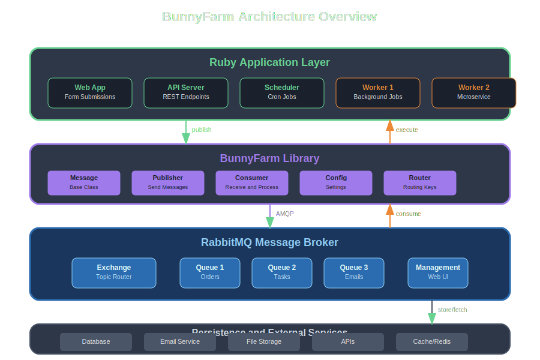

# BunnyFarm

<div align="center">
  
  <br />
  <p>
    <a href="https://badge.fury.io/rb/bunny_farm"></a>
    <a href="https://opensource.org/licenses/MIT"></a>
  </p>
</div>

Like a well-organized farm where messages hop efficiently from producers to consumers, BunnyFarm provides a lightweight Ruby gem for managing background jobs using RabbitMQ. Each message becomes a living entity with its own behavior, routing intelligently through the message broker to the right workers.

## What is BunnyFarm?

The bunny farm is an abstraction in which the messages are encapsulated as classes. Instances of these BunnyFarm::Messages are hopping around the RabbitMQ as JSON strings with routing keys in the form of `MessageClassName.action` where action is a method on the MessageClassName instance.

## Key Features

- **🐰 [Message-Centric Design](core-features/message-design.md)** - Classes encapsulate behavior and data
- **🔀 [Smart Routing](core-features/smart-routing.md)** - Automatic routing with ClassName.action keys
- **📨 [JSON Serialization](core-features/json-serialization.md)** - Simple, readable message format
- **⚙️ [Flexible Configuration](core-features/configuration.md)** - Environment, YAML, or programmatic setup
- **🔄 [Workflow Support](core-features/workflow-support.md)** - Multi-step processes with message chaining
- **⏰ [Task Scheduling](core-features/task-scheduling.md)** - Delayed execution with retry logic
- **🛡️ [Error Handling](core-features/error-handling.md)** - Built-in success/failure tracking
- **🎯 Simplicity First** - K.I.S.S. design philosophy

## Architecture Overview

BunnyFarm provides a clean, layered architecture that separates concerns and enables scalable message processing:



The architecture consists of four main layers:

1. **Ruby Application Layer** - Your web apps, API servers, schedulers, and worker processes
2. **BunnyFarm Library Layer** - Core components including Message classes, Publisher, Consumer, Config, and Router
3. **RabbitMQ Message Broker** - Handles message routing, queuing, and delivery with exchanges and queues
4. **Persistence & External Services** - Databases, email services, file storage, APIs, and caching layers

## Quick Start

Get up and running with BunnyFarm in minutes:

### Installation

Add this line to your application's Gemfile:

```ruby
gem 'bunny_farm'
```

And then execute:

```bash
bundle install
```

### Basic Usage

```ruby
require 'bunny_farm'
require 'my_message_class'

# Configure BunnyFarm
BunnyFarm.config

# Start processing messages (blocks)
BunnyFarm.manage
```

### Publishing Messages

```ruby
require 'bunny_farm'

BunnyFarm.config do
  app_id 'my_job_name'
end

# Create and publish a message
message = MyMessageClass.new
message[:field1] = 'Hello'
message[:field2] = 'World'
message.publish('action') # routing key: MyMessageClass.action

puts 'Success!' if message.successful?
```

## Why BunnyFarm?

- **Simplistic?** Because extensive is sometimes overkill
- **JSON?** Because binary compression is sometimes overkill  
- **Bunny?** Who doesn't like bunnies? They're like cats with long ears
- **AMQP?** I like AMQP. I like RabbitMQ as an AMQP broker

BTW, at the farm bunnies grow best if planted ears up. 🐰

## What's Next?

- **[Installation Guide](getting-started/installation.md)** - Detailed installation and setup
- **[Quick Start](getting-started/quick-start.md)** - Get running in 5 minutes
- **[Basic Concepts](getting-started/basic-concepts.md)** - Understand the fundamentals
- **[Examples](examples/overview.md)** - Comprehensive, runnable examples
- **[API Reference](api/message-class.md)** - Complete API documentation