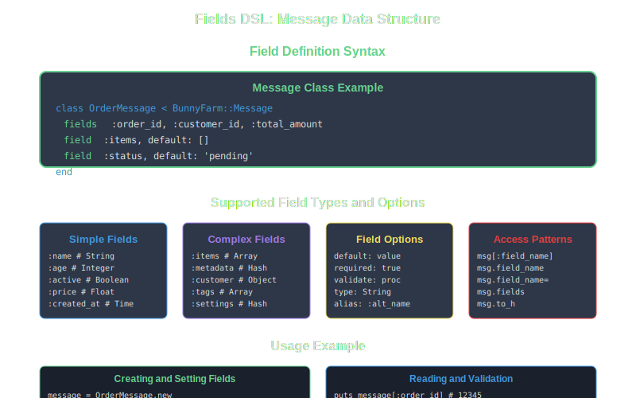

# Fields DSL

The Fields DSL is BunnyFarm's declarative syntax for defining the data structure of your messages. It provides a clean, readable way to specify expected fields and their organization.



## Basic Field Declaration

```ruby
class UserMessage < BunnyFarm::Message
  # Simple fields
  fields :user_id, :email, :name, :created_at
end
```

## Nested Objects

```ruby
class CustomerMessage < BunnyFarm::Message
  fields :customer_id, :email,
         { address: [:street, :city, :state, :zip] },
         { preferences: [:newsletter, :promotions, :sms] }
end
```

## Complex Structures

```ruby
class OrderMessage < BunnyFarm::Message
  fields :order_id, :total, :tax, :shipping,
         { customer: [:name, :email, :phone] },
         { billing_address: [:street, :city, :state, :zip, :country] },
         { shipping_address: [:street, :city, :state, :zip, :country] },
         { items: [:product_id, :name, :quantity, :unit_price, :total_price] },
         { payment: [:method, :transaction_id, :status] }
end
```

## Data Access

```ruby
message = OrderMessage.new

# Simple fields
message[:order_id] = 12345
message[:total] = 99.99

# Nested objects
message[:customer] = {
  name: "John Doe",
  email: "john@example.com",
  phone: "+1-555-123-4567"
}

# Arrays of objects
message[:items] = [
  {
    product_id: 1,
    name: "Widget",
    quantity: 2,
    unit_price: 29.99,
    total_price: 59.98
  },
  {
    product_id: 2,
    name: "Gadget",
    quantity: 1,
    unit_price: 39.99,
    total_price: 39.99
  }
]

# Access nested data
puts message[:customer][:name]        # "John Doe"
puts message[:items][0][:product_id]  # 1
puts message[:billing_address][:city] # Access nested fields
```

## Field Validation

```ruby
class ValidatedMessage < BunnyFarm::Message
  fields :user_id, :email, :age
  
  def validate
    failure("User ID required") unless @items[:user_id]
    failure("Invalid email") unless valid_email?(@items[:email])
    failure("Age must be positive") unless @items[:age]&.positive?
    
    success! if errors.empty?
  end
  
  private
  
  def valid_email?(email)
    email =~ /\A[\w+\-.]+@[a-z\d\-]+(\.[a-z\d\-]+)*\.[a-z]+\z/i
  end
end
```

## Dynamic Field Access

```ruby
message = OrderMessage.new

# Get all field keys
field_keys = message.keys
# => [:order_id, :total, :customer, :items, ...]

# Check if field exists
has_customer = message.keys.include?(:customer)

# Iterate over fields
message.keys.each do |field|
  value = message[field]
  puts "#{field}: #{value}"
end
```

## Best Practices

### 1. Logical Grouping
```ruby
# Good: Related fields grouped together
fields :order_id, :status, :created_at,
       { customer: [:id, :name, :email] },
       { items: [:id, :name, :price] }
```

### 2. Consistent Naming
```ruby
# Good: Consistent snake_case
fields :user_id, :created_at, :email_address

# Avoid: Mixed conventions
fields :userId, :created_at, :EmailAddress
```

### 3. Meaningful Structure
```ruby
# Good: Clear hierarchy
fields { address: [:street, :city, :state, :zip] }

# Avoid: Flat structure
fields :address_street, :address_city, :address_state, :address_zip
```