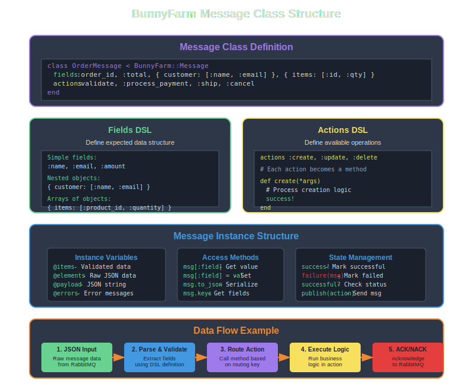

# Message Structure Overview

Understanding how BunnyFarm messages are structured is key to using the library effectively. This section covers the anatomy of a BunnyFarm message and how the DSL components work together.



## Message Class Anatomy

A BunnyFarm message class consists of several key components:

```ruby
class OrderMessage < BunnyFarm::Message
  # 1. Fields DSL - Define data structure
  fields :order_id, :total, 
         { customer: [:name, :email] }, 
         { items: [:id, :qty] }

  # 2. Actions DSL - Define available operations  
  actions :validate, :process_payment, :ship, :cancel

  # 3. Action Methods - Business logic
  def validate
    # Validation logic here
    success!
    successful?
  end

  def process_payment
    # Payment processing logic
    success!
    successful?
  end

  # 4. Helper Methods (private)
  private

  def validate_customer
    # Helper logic
  end
end
```

## DSL Components

### Fields DSL
The `fields` DSL defines the expected data structure for your messages:

- **Simple fields**: Basic data types like strings, numbers, booleans
- **Nested objects**: Complex data structures with sub-fields
- **Arrays**: Lists of items or objects

### Actions DSL  
The `actions` DSL defines the operations your message can perform:

- Each action becomes a routable method
- Actions map to routing keys: `MessageClass.action`
- Must implement corresponding methods

## Instance Structure

When a message is instantiated, it contains several important instance variables:

### @items
Validated and structured data extracted from the raw JSON based on your fields definition.

```ruby
message[:customer][:name] # Access via hash-like interface
```

### @elements
Raw JSON data as received from the message broker.

```ruby
message.elements # Access raw data
```

### @payload
The original JSON string as received from RabbitMQ.

```ruby
message.payload # Original JSON string
```

### @errors
Array of error messages accumulated during processing.

```ruby
message.errors # => ["Validation failed", "Payment declined"]
```

## Data Flow

The message goes through several stages:

1. **JSON Input** - Raw message data from RabbitMQ
2. **Parse & Validate** - Extract fields using DSL definition  
3. **Route Action** - Call method based on routing key
4. **Execute Logic** - Run business logic in action method
5. **ACK/NACK** - Acknowledge to RabbitMQ based on success/failure

## Access Methods

BunnyFarm provides several ways to access and manipulate message data:

### Hash-like Access
```ruby
msg[:field]       # Get value
msg[:field] = val # Set value
```

### JSON Serialization
```ruby
msg.to_json # Convert to JSON string
```

### Field Inspection
```ruby
msg.keys # Get all available fields
```

## State Management

Messages track their processing state throughout the lifecycle:

### Success States
```ruby
success!     # Mark as successful
successful?  # Check if successful
```

### Failure States
```ruby
failure(msg) # Mark as failed with reason
failed?      # Check if failed
```

### Publishing
```ruby
msg.publish(action) # Send message with routing key
```

## Best Practices

### 1. Design Clear Field Structures
```ruby
# Good: Clear, hierarchical structure
fields :order_id, :amount,
       { customer: [:name, :email, :phone] },
       { billing_address: [:street, :city, :state, :zip] }

# Avoid: Flat, unclear structure  
fields :order_id, :customer_name, :customer_email, 
       :billing_street, :billing_city # ... too flat
```

### 2. Use Meaningful Action Names
```ruby
# Good: Descriptive action names
actions :validate_order, :process_payment, :ship_order, :send_confirmation

# Avoid: Generic action names
actions :process, :handle, :do_work
```

### 3. Implement Proper Error Handling
```ruby
def process_payment
  return failure("Missing payment info") unless payment_present?
  return failure("Invalid amount") unless valid_amount?
  
  charge_result = payment_gateway.charge(@items[:amount])
  
  if charge_result.success?
    success!
  else
    failure("Payment failed: #{charge_result.error}")
  end
  
  successful?
end
```

### 4. Keep Methods Focused
Each action method should have a single, clear responsibility:

```ruby
def validate_order
  validate_customer_info
  validate_items
  validate_shipping_address
  
  success! if errors.empty?
  successful?
end

private

def validate_customer_info
  failure("Customer name required") if @items[:customer][:name].blank?
  failure("Customer email required") if @items[:customer][:email].blank?
end
```

## Next Steps

Now that you understand message structure, explore:

- **[Fields DSL](fields-dsl.md)** - Detailed guide to defining data structures
- **[Actions DSL](actions-dsl.md)** - Complete actions DSL reference
- **[Instance Methods](instance-methods.md)** - All available instance methods
- **[Configuration](../configuration/overview.md)** - Message configuration options