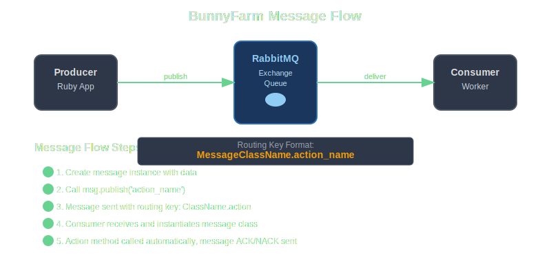
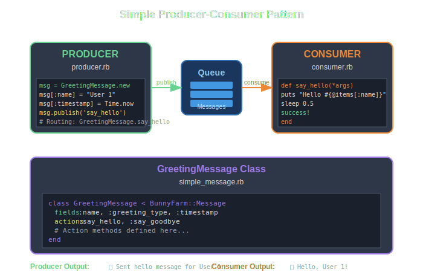
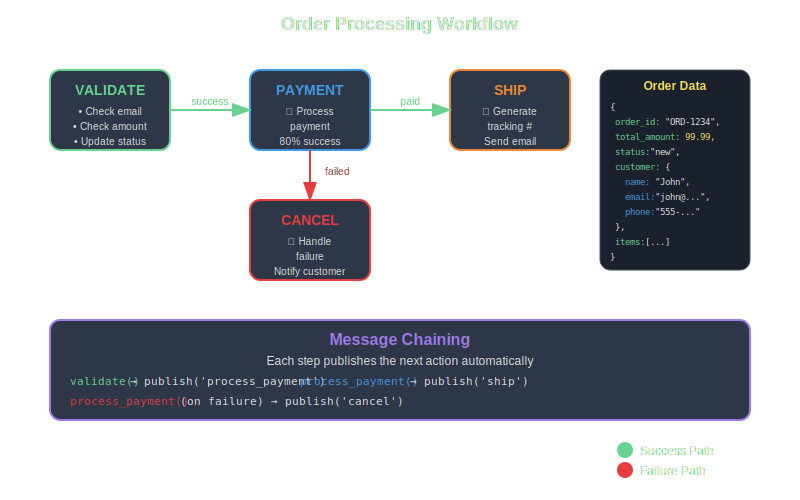

# BunnyFarm Examples

This directory contains practical examples demonstrating how to use the BunnyFarm library for background job processing with RabbitMQ.



## Prerequisites

1. **Install RabbitMQ**: Make sure RabbitMQ server is running on your system
   ```bash
   # macOS with Homebrew
   brew install rabbitmq
   brew services start rabbitmq
   
   # Ubuntu/Debian
   sudo apt-get install rabbitmq-server
   sudo systemctl start rabbitmq-server
   
   # Or use Docker
   docker run -d --name rabbitmq -p 5672:5672 -p 15672:15672 rabbitmq:3-management
   ```

2. **Install dependencies**: From the gem root directory:
   ```bash
   bundle install
   ```

## Examples Overview

### 1. Simple Producer/Consumer Pattern



**Files**: `simple_message.rb`, `producer.rb`, `consumer.rb`

The simplest example showing basic message production and consumption.

**Run the example**:
```bash
# Terminal 1 - Start the consumer
cd examples
ruby consumer.rb

# Terminal 2 - Run the producer
ruby producer.rb
```

**What it demonstrates**:
- Basic message class definition with `fields` and `actions`
- Simple message publishing
- Consumer setup and message processing
- Success/failure handling

### 2. Order Processing Workflow



**File**: `order_processor.rb`

A more complex example showing a multi-step order processing workflow with error handling.

**Run the example**:
```bash
# Terminal 1 - Start the consumer
ruby order_processor.rb --consumer

# Terminal 2 - Send orders for processing
ruby order_processor.rb --producer
```

**What it demonstrates**:
- Complex message fields with nested data structures
- Multi-action workflows (validate → process_payment → ship)
- Error handling and workflow branching
- Message chaining (publishing follow-up messages)
- Random failure simulation for testing

### 3. Task Scheduler with Retries


**File**: `task_scheduler.rb`

Demonstrates scheduled task execution with retry logic and failure handling.

**Run the example**:
```bash
# Terminal 1 - Start the worker
ruby task_scheduler.rb --worker

# Terminal 2 - Schedule tasks
ruby task_scheduler.rb --scheduler
```

**What it demonstrates**:
- Time-based task scheduling
- Retry mechanisms with exponential backoff
- Multiple task types in one message class
- Error recovery and failure reporting
- Different execution paths based on task type

## Understanding the Code Structure

### Message Class Pattern

All examples follow the same basic pattern for message classes:

```ruby
class MyMessage < BunnyFarm::Message
  # Define expected fields (can include nested structures)
  fields :field1, :field2, { nested: [:sub1, :sub2] }
  
  # Define available actions
  actions :action1, :action2
  
  # Implement action methods
  def action1(*args)
    # Process the message
    # Use @items[:field_name] to access data
    
    # Mark as successful
    success!
    
    # Or mark as failed
    # failure("Error message")
  end
end
```

### Configuration

All examples use the default configuration from `config/bunny.yml.erb`. You can customize by:

1. **Environment variables**:
   ```bash
   export AMQP_HOST=localhost
   export AMQP_VHOST=/
   export AMQP_QUEUE=my_queue
   # ... etc
   ```

2. **Programmatic configuration**:
   ```ruby
   BunnyFarm.config do
     env 'production'
     app_id 'my_worker'
     # Custom routing key for consumers
     bunny CONFIG.bunny.merge('routing_key' => 'MyMessage.*')
   end
   ```

## Running with Custom RabbitMQ Settings

If your RabbitMQ is running on a different host or with different credentials:

```bash
export AMQP_HOST=192.168.1.100
export AMQP_USER=myuser
export AMQP_PASS=mypassword
export AMQP_VHOST=myvhost

ruby consumer.rb
```

## Message Flow

Here's how messages flow through the system:

1. **Producer** creates a message instance
2. **Producer** populates message fields with `msg[:field] = value`
3. **Producer** calls `msg.publish('action_name')`
4. **RabbitMQ** receives the message with routing key `MessageClassName.action_name`
5. **Consumer** receives the message based on its routing key configuration
6. **Consumer** instantiates the message class with the JSON payload
7. **Consumer** automatically calls the appropriate action method
8. **Action method** processes the message and marks success/failure
9. **RabbitMQ** acknowledges or rejects the message based on the result

## Troubleshooting

### Connection Issues
- Make sure RabbitMQ is running: `sudo systemctl status rabbitmq-server`
- Check if the management interface is accessible: http://localhost:15672 (guest/guest)
- Verify network connectivity if using a remote RabbitMQ server

### No Messages Being Processed
- Check that producer and consumer are using compatible routing keys
- Verify queue and exchange names match between producer and consumer
- Look for error messages in the console output

### Messages Not Being Acknowledged
- Ensure action methods call `success!` on successful completion
- Check for exceptions that might prevent success marking
- Look for `failure(message)` calls that reject messages

## Next Steps

After running these examples:

1. **Modify the examples** to understand how changes affect behavior
2. **Create your own message classes** for your specific use cases
3. **Experiment with different routing patterns** and queue configurations
4. **Add monitoring and logging** for production use
5. **Consider scaling patterns** like multiple consumers or load balancing

## Additional Resources

- [RabbitMQ Documentation](https://www.rabbitmq.com/documentation.html)
- [AMQP Concepts](https://www.rabbitmq.com/tutorials/amqp-concepts.html)
- [Bunny Gem Documentation](https://github.com/ruby-amqp/bunny)

Happy message processing! 🐰